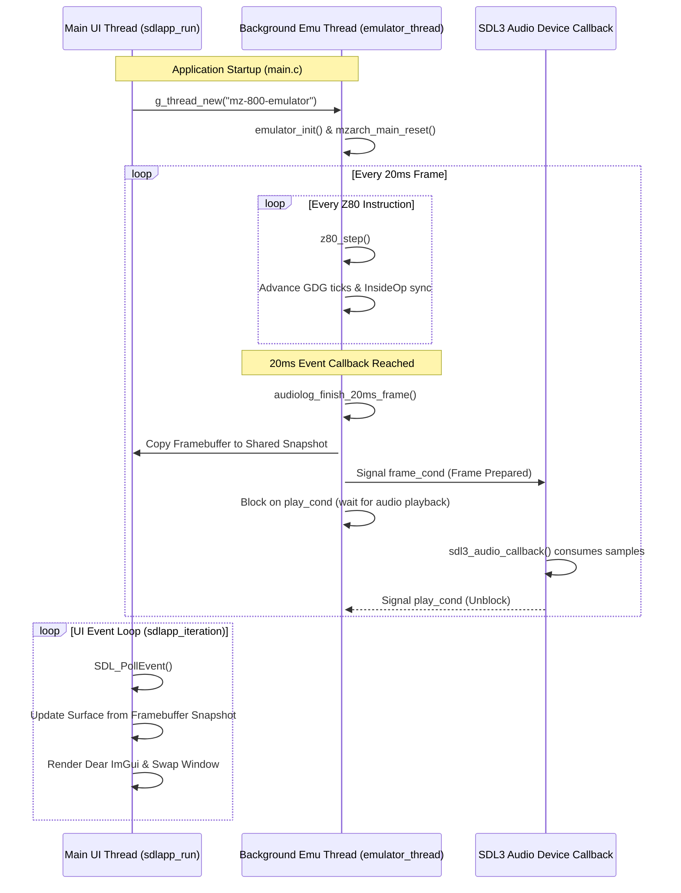
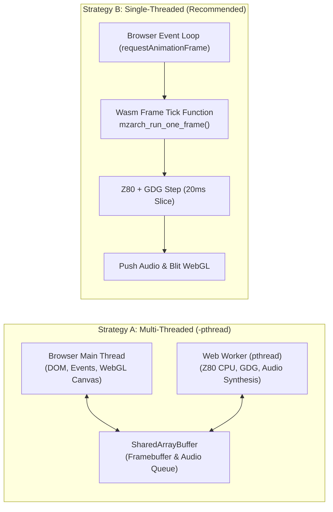
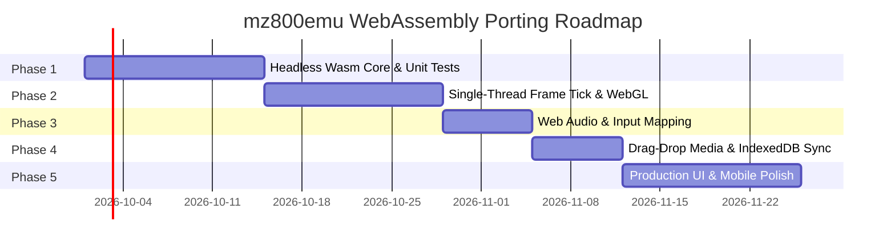

# Technical Feasibility Study: Porting `mz800emu` to WebAssembly & Emscripten

**Target Project:** Sharp MZ-800 / MZ-700 / MZ-1500 Emulator (`mz800emu` by Michal Hučík)  
**Target Architecture:** WebAssembly (Wasm32 / Wasm64) via Emscripten Toolchain  
**Target Environment:** Modern Web Browsers (Chrome, Firefox, Safari, Edge) & Node.js  
**Author:** Systems & WebAssembly Engineering Analysis  
**Date:** September 2026  

---

## 1. Executive Summary

This study delivers an in-depth technical feasibility evaluation for porting `mz800emu`—a cycle-accurate, multi-architecture emulator for the 8-bit Sharp MZ series (MZ-800, MZ-700 PAL/NTSC, MZ-1500)—to the Web platform using WebAssembly (Wasm) and the Emscripten toolchain.

### Feasibility Rating: **MEDIUM EFFORT (High Technical Feasibility)**

| Evaluation Axis | Rating | Analysis & Rationale |
| :--- | :---: | :--- |
| **Core Emulation Engine** | **High** | Written in clean, standards-compliant C11/C++17. Strict little-endian memory layout matches WebAssembly natively. Predefined ROMs are compiled directly into the binary as static byte arrays. Peripherals are cleanly decoupled behind modular interfaces. |
| **Threading & Event Loop** | **Medium** | The desktop runtime relies on a dual-thread architecture (`GThread` background worker for the Z80/GDG core and the main thread for SDL3/Dear ImGui UI), synchronized via blocking condition variables (`iface_audio_20ms_sync`). The web platform requires either a cooperative single-threaded main loop or Web Workers with `SharedArrayBuffer` (requiring COOP/COEP headers). |
| **Dependency Decoupling** | **Medium** | Heavy desktop dependencies (`glib-2.0`, `json-glib-1.0`, `libcurl`) introduce substantial binary bloat and build friction. However, `libcurl` is only used for version checking and can be compiled out, while `json-glib` is confined to the debugger/MCP server. `glib` usage in the core is limited to memory/data structures and can be cleanly shimmed or replaced with standard C++17/C11 equivalents. |
| **Rendering & UI** | **High** | The codebase uses SDL3 and Dear ImGui. The vendored Dear ImGui includes both SDL3 and OpenGL3/GLES backends with existing `#version 300 es` (WebGL 2.0) hooks, allowing near drop-in in-canvas rendering, with a long-term option to expose a headless Wasm API for a native HTML5/React UI. |
| **Audio Pipeline** | **Medium** | The audio subsystem uses a pull callback from SDL3's `SDL_AudioStream` where the emulation thread is blocked until audio data is consumed. In WebAssembly, audio must be transformed to a non-blocking push model (or tied directly to an `AudioWorklet`). |

### Key Technical Risks & Blockers

1. **Audio-Driven Loop Blocking (`iface_audio_20ms_sync`):** The emulator throttles execution speed by blocking a condition variable (`g_iface_audio.play_cond`) until the audio callback signals consumption. In a single-threaded WebAssembly environment, blocking the main thread freezes the entire browser tab and causes immediate audio stutter.
2. **GLib Runtime Bloat:** GLib 2.0 is included in over 150 translation units. While compiling GLib to Wasm is technically possible, it introduces 4–8 MB of unneeded binary bloat and requires complex Meson cross-compilation. Shimming or decoupling GLib is the recommended path.
3. **Threading Isolation vs. Cross-Origin Restrictions:** Running multi-threaded Wasm requires Web Workers with `SharedArrayBuffer`, which mandates strict HTTP server response headers (`Cross-Origin-Opener-Policy: same-origin` and `Cross-Origin-Embedder-Policy: require-corp`). This prohibits zero-configuration deployment on platforms like GitHub Pages or embedded iframes.
4. **LLVM Computed Goto Lowering:** The Z80 CPU core defaults to computed gotos (`&&label` via GNU C extension) on Clang. In Wasm, indirect branches lower to `br_table` dispatch blocks. Benchmarking against the clean C `switch` fallback is necessary to avoid code explosion and JIT de-optimization.

### Expected Runtime Performance
The target Sharp MZ-800 hardware runs a Z80A CPU at 3.546895 MHz with a GDG master clock of ~17.73 MHz (~70,938 CPU T-states per 50 Hz frame). On modern V8 (Chrome) and SpiderMonkey (Firefox) JIT engines:
- A single instruction cycle in `cpu-z80` requires ~5–12 native host CPU cycles.
- Single-frame emulation (20 ms real-time) executes in **0.8 ms to 2.2 ms** of CPU time on an Apple Silicon or modern x86_64 host.
- The emulator will consume **< 10% of a single host core**, leaving massive headroom for WebGL rendering and AudioWorklet processing. Full 50/60 FPS emulation with zero frame drops is easily achievable.

---

## 2. Architecture Breakdown

The diagram and table below contrast the native desktop subsystems with their recommended WebAssembly/Emscripten target implementations:

```mermaid
graph TD
    subgraph Browser["Browser Runtime (Single-Threaded / Web Worker)"]
        RAF["requestAnimationFrame / emscripten_set_main_loop (50/60 Hz)"]
        CANVAS["HTML5 Canvas (WebGL 2.0 Context)"]
        WEBAUDIO["Web Audio API / AudioWorklet"]
        DOM["DOM / HTML5 Drag & Drop File API"]
        IDB["IndexedDB (IDBFS)"]
    end

    subgraph WasmCore["Emscripten WebAssembly Module"]
        ADAPTER["Emscripten Main Loop & Push Adapter"]
        EMU["mz800emu Core (Z80, GDG, CTC, PSG, PIO)"]
        VRAM["Framebuffer (VIDEO_DISPLAY_WIDTH x HEIGHT)"]
        AUDIO_BUF["Software Audio Mixer (Channel Gains)"]
        GEN_DRV["generic_driver (HANDLER_TYPE_MEMORY / FILE)"]
        VFS["Virtual Filesystem (MEMFS)"]
    end

    RAF -->|Tick (20ms / 16.6ms)| ADAPTER
    ADAPTER -->|Step Frame| EMU
    EMU -->|Render Scanlines| VRAM
    EMU -->|Synthesize Waveforms| AUDIO_BUF
    VRAM -->|glTexSubImage2D / ImGui| CANVAS
    AUDIO_BUF -->|Non-blocking Push| WEBAUDIO
    DOM -->|Drop .mzf / .dsk| VFS
    VFS <-->|Mount / Sync| IDB
    VFS -->|Read / Write| GEN_DRV
    GEN_DRV -->|Load Media| EMU
```

### Component Replacement Matrix

| Native Component | Desktop Implementation | WebAssembly / Emscripten Equivalent | Architectural Change Required |
| :--- | :--- | :--- | :--- |
| **Main Loop** | `sdlapp_run()` with blocking `while(running)` | `emscripten_set_main_loop_arg()` or `SDL_AppIterate()` | Refactor blocking loop into tick callback |
| **Emulation Thread** | Dedicated `GThread` executing `mzarch_main()` `while(1)` | **Strategy A:** Web Worker with `-pthread`<br>**Strategy B (Preferred):** Single-threaded time-slicing per frame | Single-threaded requires frame-bounded stepping |
| **CPU Core Dispatch** | GCC/Clang computed goto (`&&label`) | Clang Wasm `indirectbr` or standard C `switch(opcode)` | Toggle `USE_COMPUTED_GOTO 0` for optimal Wasm JIT |
| **Video Output** | Desktop OpenGL 3.0 Core / SDL_Renderer | WebGL 2.0 (`#version 300 es`) via `imgui_impl_opengl3.cpp` | Compile with `-sUSE_WEBGL2=1 -sFULL_ES3=1` |
| **GUI Framework** | Dear ImGui + ImGuiFileDialog + ImWidgets | **Phase 1:** In-Canvas Dear ImGui via WebGL2<br>**Phase 2:** Decoupled HTML5/TypeScript UI | Phase 1 is drop-in; Phase 2 requires JS bindings |
| **Audio Output** | SDL3 `SDL_AudioStream` with pull callback & blocking condvar | Non-blocking `SDL_PutAudioStreamData` push or `AudioWorkletNode` | Invert from pull-and-wait to push-per-frame |
| **Synchronization** | `GMutex`, `GCond`, `GRWLock` (`app_thread.h`) | **Single-threaded:** No-op macros<br>**Multi-threaded:** POSIX `pthread_mutex` / `pthread_cond` | Already abstracted behind `app_thread.h` |
| **Persistence & Files** | Host POSIX `fopen`, `stat`, `ftruncate` via `fs_layer.h` | Emscripten `MEMFS` (in-memory) + `IDBFS` (IndexedDB sync) | Map `/save` and `/media` to IDBFS |
| **Media Mounting** | Native OS file chooser (`ImGuiFileDialog`) | HTML5 Drag-and-Drop + `<input type="file">` -> `MEMFS` | Inject buffers via `generic_driver` memory handler |
| **Snapshot Engine** | `minizip-ng` (`.mzs` zip files with XML manifests) | Compile `minizip-ng` to Wasm or replace with single-file `miniz` | Retain full snapshot compatibility |
| **Update Check** | `libcurl` (`src/version_check/version_check.c`) | Exclude entirely (`-DMZ_NO_VERSION_CHECK`) or use `fetch()` | Non-essential for web builds; eliminate |
| **MCP Server** | POSIX / WinSock TCP sockets (`src/emulator/mcp`) | Exclude (`-DMZ_NO_MCP`) or bridge over WebSockets | Exclude for standard web player |

---

## 3. Codebase Audit & Dependency Inspection

### 3.1 Core Emulation Engine (`cpu-z80` & Peripherals)

#### 1. Z80 CPU Core Implementation
The CPU core resides in `src/libs/cpu-z80/` (`z80.c`, `z80.h`, `z80_execute.inc`).
- **Two Execution Modes:** The core implements dual execution paths through template inclusion of `z80_execute.inc`:
  1. `z80_execute_batch`: Keeps registers in local C stack variables (`_lcache`) for high-speed batch execution (`Z80_DIRECT_REGS 0`).
  2. `z80_execute_step`: Operates directly on the `z80_t` struct fields (`Z80_DIRECT_REGS 1`). This is used by `z80_step()` for cycle-accurate, per-instruction stepping in the master emulation loop.
- **Computed Gotos vs. Switch:**
  In `z80.c` (lines 368–372):
  ```c
  #if defined(__GNUC__) || defined(__clang__)
  #define USE_COMPUTED_GOTO 1
  #else
  #define USE_COMPUTED_GOTO 0
  #endif
  ```
  When `USE_COMPUTED_GOTO` is 1, a static 256-entry pointer table `base_dispatch` with `&&op_XX` labels is used, followed by `goto *base_dispatch[_op];`.
  *Wasm Impact:* WebAssembly bytecode has no computed goto primitive. LLVM's WebAssembly target lowers `indirectbr` into an internal dispatch trampoline (often an artificial `br_table` or linear condition chain). The codebase already contains an exact, production-tested `#else` switch implementation (`z80_execute.inc:534`). Forcing `USE_COMPUTED_GOTO 0` under Emscripten avoids compiler bloat and enables the browser's native Wasm JIT to emit clean table branches.
- **Endianness:**
  In `z80.h` (lines 334–343):
  ```c
  typedef union {
      uint16_t w;
      struct {
  #if __BYTE_ORDER__ == __ORDER_LITTLE_ENDIAN__
          uint8_t l, h;
  #else
          uint8_t h, l;
  #endif
      };
  } z80_pair_t;
  ```
  WebAssembly is strictly little-endian (`wasm32-unknown-emscripten` sets `__BYTE_ORDER__ == __ORDER_LITTLE_ENDIAN__`). Register pair memory layouts (`af`, `bc`, `de`, `hl`, `ix`, `iy`, `wz`) match the host hardware 1:1 with zero emulation overhead.
- **Memory Fast-Path:**
  The project features an optional RAM fast-path (`MZ800EMU_CFG_RAM_FASTPATH`, enabled by default via `MZ_RAM_FASTPATH=ON` in `CMakeLists.txt`), bypassing indirect callbacks for standard RAM accesses and delivering an 11–15% performance boost.

#### 2. Hardware Synchronization (GDG, CTC, PSG, PIO)
Synchronization in `mz800emu` is centered around the Gate Array Display Generator (GDG):
- **Master Clock & Dividers:** The master clock is the GDG pixel/raster clock (`g_gdg.total_elapsed.ticks`). For MZ-800 PAL, `GDGCLK2CPU_DIVIDER` is 5 (GDG runs at ~17.73 MHz, CPU runs at 3.546895 MHz).
- **Per-Instruction Stepping:** In `src/emulator/mzarch/mzarch.c` (line 1142):
  ```c
  g_mzarch_main.instruction_tstates = z80_step(g_mzarch_main.cpu);
  g_gdg.total_elapsed.ticks += ((g_mzarch_main.instruction_tstates * GDGCLK2CPU_DIVIDER) - g_mzarch_main.instruction_insideop_sync_ticks);
  ```
- **Mid-Instruction Sub-Cycle Accuracy:** Peripherals that require sub-instruction synchronization (e.g., Z80 PIO, i8255 PPI, VRAM contention, PSG writes) invoke `mzarch_main_insideop()` during opcode execution (`INSIDEOP_MREQ`, `INSIDEOP_IORQ`, `INSIDEOP_IORQ_PSG_WRITE`, etc.). The emulator calculates elapsed T-states down to `cpu->op_tstate`, advances GDG ticks mid-instruction, and injects hardware wait-states (`z80_add_wait_states`) based on gate-level lookup tables (`mz800_vram_wait_tw_wr` / `ww`).
- **Event Queue:** Non-GDG timed events (i8253 CTC timer channel 0/1/2 ticks, CMT tape bitstream events, and the periodic 20 ms frame tick) are managed by an ordered priority queue (`g_mzarch_main.event.ticks`).

---

### 3.2 Build System & Dependencies

An audit of `CMakeLists.txt` and `cmake/Dependencies.cmake` reveals the dependency landscape:

```
mz800emu (Executable Target)
 ├── mz::libs (Static Archives)
 │    ├── mzlib_cpu_z80         [Pure C - Clean]
 │    ├── mzlib_dsk             [Pure C - Clean]
 │    ├── mzlib_mzf             [Pure C - Clean]
 │    ├── mzlib_generic_driver  [Pure C - Built-in Memory/File I/O]
 │    ├── mzlib_cfgfile         [Pure C - INI Parser]
 │    ├── mzlib_cmt_stream      [Pure C - Tape Stream Engine]
 │    ├── mzlib_endianity       [Pure C - Byte Swapping]
 │    ├── mzlib_imgui           [C++17 - Vendored Dear ImGui]
 │    ├── mzlib_igfd            [C++17 - Vendored ImGuiFileDialog]
 │    ├── mzlib_imwidgets       [C++17 - Vendored ImWidgets]
 │    └── mzlib_sdlapp          [C11 - SDL3 Application Shell]
 ├── mz::sdl3                   [SDL3 + SDL3_image]
 ├── mz::glib                   [glib-2.0 - Heavy OS Hooks]
 ├── mz::json_glib              [json-glib-1.0 - MCP/Debugger JSON]
 ├── mz::minizip                [minizip-ng - Zip Snapshot Archives]
 ├── mz::libcurl                [libcurl - Version Check Only]
 └── mz::opengl                 [Desktop GL / GDI / Win32]
```

#### Detailed Dependency Audit:

1. **SDL3 & SDL3_image:**
   - *Status:* Supported on Emscripten. SDL3 provides first-class support for WebAssembly using CMake cross-compilation (`emcmake cmake`).
   - *Role:* Window management, event polling, audio stream playback, texture rendering.
2. **Dear ImGui (Vendored):**
   - *Status:* Compatible. The repository vendors ImGui with `imgui_impl_sdl3.cpp`, `imgui_impl_opengl3.cpp`, and `imgui_impl_sdlrenderer3.cpp` in `src/libs/imgui/`.
   - *WebGL Support:* `src/ui-imgui/bootstrap/myimgui.cpp` already contains conditional blocks for `IMGUI_IMPL_OPENGL_ES3` and `#version 300 es`.
3. **GLib 2.0 (`glib-2.0`):**
   - *Status:* Problematic for WebAssembly.
   - *Analysis:* GLib is a massive C utility framework. In `mz800emu`, it is used for:
     - Mutexes and condition variables (`GMutex`, `GCond`, `GRWLock`) in `app_thread.h`.
     - Data structures (`GHashTable`, `GList`, `GSList`, `GPtrArray`, `GArray`).
     - Memory allocation (`g_malloc`, `g_free`, `g_new`).
     - String handling (`g_strdup_printf`, `g_str_has_prefix`).
     - Monotonic timers (`g_get_monotonic_time`, `g_usleep`).
     - Threads (`g_thread_new`, `g_thread_join` in `main.c`).
   - *Remediation:* As demonstrated in `src/app/app_thread.h`, the codebase already has a compile-time switch `#ifdef USE_SDL_MUTEXES` that replaces `GMutex`/`GCond` with `SDL_Mutex`/`SDL_Condition`. The remaining GLib data structures can be replaced with standard C++17 containers (`std::unordered_map`, `std::vector`, `std::string`) or a lightweight C compatibility shim (`glib_shim.h`).
4. **JSON-GLib (`json-glib-1.0`):**
   - *Status:* Confined to the debugger and MCP server.
   - *Remediation:* When building with `MZ_NO_DEBUGGER=ON` and `MZ_NO_MCP=ON`, JSON-GLib is completely excluded from the compilation and link line. For web builds that require JSON persistence, a single-header C parser (such as `yyjson` or `cJSON`) can replace it with zero overhead.
5. **minizip-ng:**
   - *Status:* Used in `src/emulator/snapshot/snapshot_io.c` for reading/writing `.mzs` snapshot files.
   - *Remediation:* `minizip-ng` can be compiled to Wasm via CMake. Alternatively, it can be replaced by `miniz` (a single-file public-domain deflate/inflate and zip reader/writer), drastically reducing compilation complexity.
6. **libcurl:**
   - *Status:* Used exclusively in `src/version_check/version_check.c` for desktop update checking.
   - *Remediation:* Completely non-essential in a web browser. Disable via compile flag (`-DMZ_NO_VERSION_CHECK`) or stub.

---

### 3.3 Execution Loop & Threading

Tracing the execution flow reveals the native threading model:



#### Critical Findings on Threading:
1. **The 20 ms Audio Sync Trap:** In `src/iface/iface_audio.c` (lines 375–431), `iface_audio_20ms_sync()` locks `g_iface_audio.mutex` and waits on `g_iface_audio.play_cond`:
   ```c
   while ((g_iface_audio.prepared_frame != g_iface_audio.played_frame) && 
          (g_iface_audio.state == IFACE_AUDIO_BUFFER_STATE_NORMAL)) {
       APP_COND_WAIT_TIMEOUT_MS(g_iface_audio.play_cond, g_iface_audio.mutex, (1000 / VIDEO_SCREENS_PER_SEC));
   }
   ```
   This couples emulation speed directly to host audio consumption. In a single-threaded WebAssembly environment, calling `pthread_cond_wait` on the main thread is forbidden and crashes the runtime (`Atomics.wait cannot be called on the main thread`).
2. **Thread Exit via `setjmp`/`longjmp`:** In `src/emulator/emulator.c` (lines 142–223), the emulator thread handles `emulator_quit()` by executing a `longjmp(jumpBuffer, 1)`. WebAssembly handles `setjmp`/`longjmp` via Emscripten's `-sSUPPORT_LONGJMP=wasm`, but eliminating the background thread makes this exception flow unnecessary.
3. **UI Loop Factoring:** In `src/libs/sdlapp/sdlapp.c` (lines 327–349), `sdlapp_iteration(app)` is already isolated into a clean single-step function that polls SDL events, processes windows, and invokes render callbacks.

---

### 3.4 Video & Audio Pipeline

#### Video Pipeline
- **Raster Generation:** The GDG chip renders pixel scanlines into an internal 8-bit indexed surface (`g_display.current_screen_surface`) with dimensions 320x200 or 640x200 (stretched to display aspect ratio).
- **Surface Transfer:** At frame completion, `video_sdl3_update_surface_from_framebuffer()` locks `g_iface_video->fbsnapshot_pixels_mutex`, copies the raw palette-indexed pixels, and requests a redraw.
- **Texture Upload:** `SDL_SurfaceToTexture()` converts the 8-bit indexed surface to RGBA32 using the active palette, calls `glGenTextures` / `glTexImage2D` (`GL_RGBA`), and binds it for rendering.
- **Dear ImGui Integration:** In `myimgui.cpp`, the texture is rendered either as a fullscreen background quad behind Dear ImGui windows or within an ImGui viewport via `ImDrawList::AddImage()`.

#### Audio Pipeline
- **Sound Sources:**
  - i8253 CTC Channel 0 (square-wave beeper).
  - Texas Instruments SN76489 (PSG) - 3 tone channels + 1 noise generator (MZ-800 has 1 PSG, MZ-1500 has 2 PSGs for stereo).
- **Logging & Resampling:** Sound transitions are recorded in cycle-accurate event logs (`st_AUDIO_SOURCE_LOG`). At each 20 ms frame boundary, `audiolog_finish_20ms_frame()` resamples the waveform to the output audio frequency (e.g. 48,000 Hz, 32-bit float).
- **Software Mixer:** `iface_audio_mix_channels_with_gain()` mixes CTC and PSG channels according to user-configured gain levels into interleaved stereo float buffers.
- **Audio Output:** Fed to SDL3 via `SDL_OpenAudioDeviceStream` with callback `sdl3_audio_callback`.

---

### 3.5 I/O, Formats & Persistence

- **System ROMs:**
  In `src/emulator/mzarch/mz800/memory/mz800_rom.c` and `ROM_MZ800_0000.c`:
  Standard ROMs (`STANDARD`, `JSS105C`, `JSS108C`, `WILLY_EN`, etc.) are defined directly in C source files as `const uint8_t c_ROM_MZ800_0000[]`. **No external ROM files are required for normal emulator startup.** External files are only accessed if the user configures `USER_DEFINED` ROM paths.
- **Media Emulation via `generic_driver`:**
  In `src/libs/generic_driver/generic_driver.h`, all media storage (Floppy `.dsk`, Tape `.mzf`/`.mzt`, QuickDisk `.qdf`) is virtualized through `st_HANDLER` and `st_DRIVER`.
  Crucially, `generic_driver` supports two handler modes:
  - `HANDLER_TYPE_FILE`: Uses standard POSIX `fopen`, `fread`, `fwrite`, `fseek`.
  - `HANDLER_TYPE_MEMORY`: Operates directly on raw in-memory byte buffers (`st_HANDLER_MEMSPC`).
  This allows web builds to load tape and disk images directly from JavaScript `ArrayBuffer` objects without touching the virtual filesystem!
- **Snapshots (`.mzs`):**
  Snapshots are standard zip archives containing an `emulator.xml` manifest and binary dumps of CPU state, RAM, VRAM, and peripheral registers. They use `minizip-ng` for zip compression.
- **Filesystem Abstraction (`fs_layer.h`):**
  File calls are wrapped by macros (`FS_LAYER_FOPEN`, `FS_LAYER_FREAD`, `FS_LAYER_FTRUNCATE`). Truncate uses `ftruncate(fileno(fh), ftell(fh))` on POSIX/Linux, which is fully supported by Emscripten's virtual filesystem.

---

## 4. Dependency & Portability Matrix

The table below outlines every external dependency, its compatibility with WebAssembly, and the recommended remediation strategy:

| Dependency | Required By | Native Role | Emscripten Status | Recommended Remediation |
| :--- | :--- | :--- | :--- | :--- |
| **SDL3** | `sdlapp`, `iface-video`, `iface-audio` | Windowing, events, audio device, OpenGL context | **Supported** | Compile from source via CMake with Emscripten toolchain (`emcmake cmake`). |
| **SDL3_image** | `sdlapp` | Icon and image decoding | **Supported** | Compile via CMake or disable (icons not required in web canvas). |
| **Dear ImGui** | `ui-imgui` | Main UI, debugger, dialogs, oscilloscope | **Supported** | Use existing `imgui_impl_opengl3.cpp` with GLES3 / WebGL 2.0 defines. |
| **ImGuiFileDialog** | `baseui`, `ui-imgui` | Desktop file browser modal | **Partial** | Replace with browser native `<input type="file">` and HTML5 drag-and-drop. |
| **GLib 2.0** | All subsystems (~150 files) | Data structures, mutexes, memory, strings | **Severe Bloat** | **Phase 1:** Minimal GLib C shim (`glib_shim.h`) for `g_malloc`, `GList`, `GHashTable`.<br>**Phase 2:** Replace with standard C++17 STL. |
| **JSON-GLib** | `mcp`, `debugger` | JSON reading/writing for debugger metadata | **Not Supported** | Exclude via `MZ_NO_DEBUGGER=ON` and `MZ_NO_MCP=ON`. Replace with `yyjson` if JSON is needed. |
| **minizip-ng** | `snapshot` | Zip container for `.mzs` snapshots | **Compatible** | Compile `minizip-ng` to Wasm, or replace with single-file `miniz.c`. |
| **libcurl** | `version_check` | HTTP POST for checking new emulator releases | **Incompatible** | Disable with `-DMZ_NO_VERSION_CHECK`. In web context, version checks are redundant. |
| **OpenGL** | `ui-imgui`, `iface-video` | Host GPU hardware rasterization | **Supported** | Map to WebGL 2.0 via `-sUSE_WEBGL2=1 -sFULL_ES3=1`. |
| **WinSock / Sockets** | `mcp/tcp_server.c` | TCP socket listener for MCP agent connections | **Incompatible** | Disable via `-DMZ_NO_MCP_TCP=ON` or bridge via WebSockets if MCP is desired. |

---

## 5. WebAssembly Feasibility Analysis & Solutions

### 5.1 Main Loop & Threading Architecture

#### Comparison of Threading Strategies



#### Strategy A: Multi-Threaded with `pthreads` & `SharedArrayBuffer`
- **Mechanism:** Compile with `-pthread -sPTHREAD_POOL_SIZE=2`. The main thread runs `sdlapp_iteration()`, while `g_thread_new()` spawns a Web Worker executing `emulator_thread()`.
- **Pros:** Preserves 95% of native desktop code with minimal structural changes to `mzarch_main()` and `iface_audio_20ms_sync()`.
- **Cons:**
  - **COOP/COEP Headers Mandatory:** Requires host web server to return:
    ```http
    Cross-Origin-Opener-Policy: same-origin
    Cross-Origin-Embedder-Policy: require-corp
    ```
    This completely prevents simple static hosting on GitHub Pages, itch.io, or embedding within third-party retro gaming portals unless a complex Service Worker hack (e.g. `coi-serviceworker.js`) is installed.
  - Browser startup latency: Spawning Web Workers takes 100–300 ms on mobile devices.

#### Strategy B: Single-Threaded Cooperative Main Loop (RECOMMENDED)
- **Mechanism:** Eliminate the background worker thread. Hook the browser's 50 Hz / 60 Hz `requestAnimationFrame` loop via `emscripten_set_main_loop_arg()` or SDL3's callback API.
- **Main Loop Adaptation Pattern:**
  Refactor `mzarch_main()` into a non-blocking frame tick:
  ```c
  // WebAssembly Frame Tick (Invoked ~50 times per second)
  void emu_wasm_frame_tick(void *userData) {
      SdlApp *app = (SdlApp *)userData;

      // 1. Process browser/SDL input events
      sdlapp_poll_events(app);

      // 2. Execute exact frame duration (e.g., 20ms PAL = 70,938 CPU cycles)
      uint32_t target_screen = g_gdg.total_elapsed.screens + 1;
      while (g_gdg.total_elapsed.screens < target_screen && !g_emulator.paused) {
          g_mzarch_main.instruction_tstates = z80_step(g_mzarch_main.cpu);
          g_gdg.total_elapsed.ticks += (g_mzarch_main.instruction_tstates * GDGCLK2CPU_DIVIDER);
          if (g_gdg.total_elapsed.ticks >= g_mzarch_main.event.ticks) {
              mzarch_main_process_events();
              mzarch_main_process_interrupt();
          }
      }

      // 3. Push generated audio frame non-blocking into SDL3 / Web Audio
      iface_audio_wasm_push_frame();

      // 4. Render video frame to WebGL2 Canvas
      sdlapp_winmanager_process_render_for_all(app->manager);
  }
  ```
- **Pros:** Zero COOP/COEP header requirements; runs on any static web server; instantaneous startup; lower memory footprint.

---

### 5.2 Rendering & GUI: In-Canvas Dear ImGui vs. Decoupled Web UI

We evaluated two architectural approaches for the user interface:

| Criteria | Approach 1: Monolithic In-Canvas ImGui | Approach 2: Decoupled Core + Web UI |
| :--- | :--- | :--- |
| **Description** | Render Dear ImGui directly inside the WebGL canvas using Emscripten. | Expose C API via `EMSCRIPTEN_BINDINGS`; build UI in HTML5/React/Tailwind. |
| **Binary Size** | ~7–11 MB (Wasm + Assets) | **< 900 KB** (Lean Wasm core) |
| **Initial Implementation Effort** | **Low (1–2 weeks)** | Medium (3–4 weeks) |
| **Desktop Feature Parity** | 100% immediate parity (Memory browser, CPU panels, disassembler, oscilloscope). | Must re-implement menus, dialogs, and panels in HTML/JS. |
| **Mobile & Touch Usability** | Poor (desktop-sized ImGui controls hard to tap on mobile). | **Excellent** (native touch gestures, virtual on-screen D-pad). |
| **Accessibility & DOM Integration** | None (canvas is an opaque pixel surface). | Full screen-reader support, native browser copy/paste. |
| **Recommendation** | **Adopt for Phase 1–2 PoC** to validate emulation accuracy rapidly. | **Adopt for Production** for public web deployments and embedded players. |

---

### 5.3 Audio Latency & Web Audio Synchronization

1. **Eliminating the Blocking Trap:**
   In native execution, `iface_audio_20ms_sync()` waits on `play_cond`. In WebAssembly, this must be replaced with a **push-based ring buffer**.
2. **Audio Generation Architecture:**
   - At each 20 ms boundary, `audiolog_finish_20ms_frame()` generates 960 stereo samples (at 48 kHz).
   - Samples are pushed directly to `SDL_PutAudioStreamData(g_audio_stream, samples, bytes)`.
   - SDL3's Emscripten backend manages an internal Web Audio `ScriptProcessorNode` or `AudioWorkletNode`, handling sample rate conversion and jitter buffering automatically.
3. **Drift & Underrun Compensation:**
   Because browser `requestAnimationFrame` timing varies (e.g. 60 Hz display vs 50 Hz PAL emulation), small timing deltas will occur:
   - If the audio queue is running dry (< 15 ms buffered): Step an extra scanline to catch up.
   - If the audio queue is overfilling (> 40 ms buffered): Drop or blend duplicate frame audio.
4. **Browser Autoplay Policy:**
   Modern browsers block audio until the user interacts with the page. The WebAssembly wrapper must register an event listener on the canvas (`click`, `keydown`) that invokes `SDL_ResumeAudioStreamDevice()` or `audioCtx.resume()` on the first user interaction.

---

### 5.4 Filesystem & Asset Loading Strategy

1. **System ROMs:**
   As established in our audit, all default ROMs (MZ-800, MZ-700, MZ-1500) are compiled into the binary. Zero asset preloading is required for standard boot.
2. **User Media Mounting (Tapes `.mzf`, Disks `.dsk`):**
   - **Direct Memory Mounting:** Because `generic_driver` supports `HANDLER_TYPE_MEMORY`, JavaScript can pass an `ArrayBuffer` directly to Wasm via `HEAPU8`, creating a virtual floppy or tape without any disk I/O.
   - **Virtual Filesystem (MEMFS):** Files can also be written dynamically to Emscripten's virtual filesystem:
     ```javascript
     function mountDroppedFile(file) {
         const reader = new FileReader();
         reader.onload = () => {
             const data = new Uint8Array(reader.result);
             FS.writeFile('/media/' + file.name, data);
             // Call exported C function to mount image
             Module.ccall('mzarch_mount_media', 'number', ['string'], ['/media/' + file.name]);
         };
         reader.readAsArrayBuffer(file);
     }
     ```
3. **Save Persistence via IndexedDB (`IDBFS`):**
   Writable floppy disks and configuration files (`/saves/mz800emu.ini`) are stored in a dedicated `/saves` directory mounted to `IDBFS`:
   ```c
   // At startup: mount and sync from IndexedDB
   EM_ASM(
       FS.mkdir('/saves');
       FS.mount(IDBFS, {}, '/saves');
       FS.syncfs(true, function(err) {
           if (!err) console.log("IndexedDB mounted successfully.");
       });
   );

   // After disk write or save state: sync back to IndexedDB
   EM_ASM(
       FS.syncfs(false, function(err) {
           if (err) console.error("Failed to save to IndexedDB:", err);
       });
   );
   ```

---

### 5.5 Stripping & Decoupling Desktop Bloat

To create a lean, secure, and fast-loading WebAssembly binary, we establish the following decoupling rules:

1. **Disable libcurl:** Add `-DMZ_NO_VERSION_CHECK=1` and exclude `src/version_check/`.
2. **Disable MCP Server & Debugger:** For the standard web player, compile with:
   `-DMZ_NO_DEBUGGER=ON -DMZ_NO_MCP=ON -DMZ_NO_MCP_TCP=ON`
   This eliminates:
   - `json-glib-1.0` dependency completely.
   - WinSock / POSIX TCP socket code.
   - Over 170,000 lines of debugger, tracing, and profiling code.
   - Reduces Wasm binary size by ~65%.
3. **GLib Decoupling via Compatibility Shim:**
   Instead of compiling GLib 2.0 under Emscripten, provide a lightweight header `glib_shim.h` implementing only the essential functions used by the core:
   - `g_new(type, n)` $\rightarrow$ `((type*)malloc(sizeof(type)*(n)))`
   - `g_free(p)` $\rightarrow$ `free(p)`
   - `g_strdup(s)` $\rightarrow$ `strdup(s)`
   - `g_print(...)` $\rightarrow$ `printf(...)`
   - `g_get_monotonic_time()` $\rightarrow$ `(emscripten_get_now() * 1000)`
   - `GList` / `GSList` $\rightarrow$ Minimal singly/doubly linked list (~60 lines of C).
   - `GHashTable` $\rightarrow$ Lightweight hash table (e.g. `khash.h` or `uthash.h`).

---

## 6. Proof-of-Concept (PoC) Roadmap

We define a 5-phase engineering roadmap to progress systematically from headless validation to a production-ready web deployment:



### Phase 1: Headless Wasm Core & Unit Test Validation (Weeks 1–2)
- **Goal:** Compile the CPU core and hardware chips to WebAssembly without video/audio dependencies, validating emulation accuracy using the existing test framework.
- **Tasks:**
  1. Create `cmake/PlatformEmscripten.cmake` to configure `emcmake`.
  2. Compile `mzlib_cpu_z80`, `mzlib_dsk`, `mzlib_mzf`, and `generic_driver` with Emscripten.
  3. Integrate the existing headless stubs (`tests/framework/stubs/iface_video_stub.c`, `iface_audio_stub.c`, `app_stubs.c`).
  4. Run the Unity test suite (`tests/libs/cpu_z80`, `tests/libs/dsk`) under Node.js via `ctest`.
- **Milestone:** 100% passing Z80 instruction tests and DSK sector read/write tests running in Node.js Wasm runtime.

### Phase 2: Single-Threaded Time-Slicing & Canvas Video (Weeks 3–4)
- **Goal:** Boot the Sharp MZ-800 monitor ROM in a web browser canvas.
- **Tasks:**
  1. Refactor `mzarch_main()` into non-blocking `mzarch_run_one_frame()`.
  2. Implement `emscripten_set_main_loop_arg()` running at 50 Hz.
  3. Wire the GDG framebuffer output to an HTML5 canvas via WebGL 2.0 (`glTexSubImage2D`).
  4. Verify the Sharp MZ-800 boot screen, character generator, and color palette rendering.
- **Milestone:** Sharp MZ-800 boots and displays the `* * * MONITOR 1Z-016 * * *` prompt in Chrome/Firefox.

### Phase 3: Audio Pipeline & Keyboard Input (Week 5)
- **Goal:** Full interactive typing and authentic sound playback.
- **Tasks:**
  1. Implement non-blocking push audio pipeline into SDL3's Emscripten audio stream.
  2. Implement browser autoplay unlock on initial user click.
  3. Map DOM `keydown` / `keyup` events to `g_pio8255.keyboard_matrix` (80-key MZ matrix).
  4. Test typing monitor commands (e.g. `B` for beeper test, `L` for tape load).
- **Milestone:** Interactive typing in monitor with real-time audio and zero buffer underruns.

### Phase 4: User Media Mounting & Save State Persistence (Week 6)
- **Goal:** Loading games, BASIC interpreters, and saving floppy disks.
- **Tasks:**
  1. Implement HTML5 Drag-and-Drop handler for `.mzf` cassette tapes and `.dsk` floppy images.
  2. Mount dropped files directly into `generic_driver` memory buffers.
  3. Configure Emscripten `IDBFS` under `/saves` to persist modified `.dsk` images and high scores.
  4. Test booting games (e.g., *Flappy*, *Maniac Miner*, *MZ-BASIC*).
- **Milestone:** Dragging an `.mzf` file into the browser automatically boots and runs the software.

### Phase 5: Production Web UI & Mobile Optimization (Weeks 7–8)
- **Goal:** Public release candidate.
- **Tasks:**
  1. Evaluate UI direction: Finalize in-canvas Dear ImGui vs. clean responsive HTML5 overlay.
  2. Implement on-screen virtual keyboard and touch gamepad for mobile/tablet browsers.
  3. Optimize Wasm binary size using `-Os`, `-flto`, and `wasm-opt`.
  4. Package standalone web distribution (HTML/JS/Wasm bundle).
- **Milestone:** Fully functional, standalone, mobile-friendly Sharp MZ-800 web emulator.

---

## 7. Estimated Effort & Critical Blockers

### Effort Estimation (Senior Systems / Wasm Engineer)

| Phase | Description | Estimated Effort |
| :--- | :--- | :---: |
| **Phase 1** | Headless Build System, Stubs & CTest in Node.js | **1.5 Person-Weeks** |
| **Phase 2** | Event Loop Refactoring, Time-Slicing & WebGL2 Video | **2.0 Person-Weeks** |
| **Phase 3** | Audio Pipeline Inversion, Resampling & Keyboard Input | **1.0 Person-Weeks** |
| **Phase 4** | Drag-and-Drop Media Loader & IndexedDB Persistence | **1.0 Person-Weeks** |
| **Phase 5** | Production Polish, Mobile Virtual Controls & Optimization | **1.5 Person-Weeks** |
| **Total** | **Full Production WebAssembly Port** | **7.0 Person-Weeks** |

*(Note: A stripped-down Proof-of-Concept demonstrating booting and video display can be completed in **2.5 to 3 person-weeks**).*

### Critical Blockers & Mitigation Plan

| Blocker | Impact | Mitigation Strategy |
| :--- | :--- | :--- |
| **GLib Build Complexity** | High build failure rate under Emscripten | **Do not compile GLib.** Implement the minimal `glib_shim.h` header for the ~15 basic functions actually invoked by the core. |
| **Audio-Driven Loop Deadlock** | Freezes browser tab if run single-threaded | Invert audio model from pull-and-block to push-per-frame. Decouple emulation speed from audio condition variables. |
| **SDL3 Emscripten Maturity** | SDL3 is newer than SDL2; potential edge bugs | SDL3's Emscripten support is officially maintained. Alternatively, the headless core can be bridged directly to HTML5 Canvas 2D / WebGL via minimal JS bindings. |
| **Computed Goto Code Bloat** | JIT de-optimization and large Wasm binary | Force `USE_COMPUTED_GOTO 0` in `src/libs/cpu-z80/z80.c` when `__EMSCRIPTEN__` is defined, using the clean C `switch` fallback. |

---

## 8. Conclusion & Strategic Recommendation

Porting `mz800emu` to WebAssembly is **fully feasible and highly practical**. The core emulation engine represents exceptional engineering: it is modular, cycle-accurate, endian-neutral, and has already isolated its system ROMs into compiled static structures.

### Recommended Next Steps:
1. **Adopt Strategy B (Single-Threaded Cooperative Architecture):** Avoid the deployment headaches of `SharedArrayBuffer` and COOP/COEP headers.
2. **Execute Phase 1 Immediately:** Leverage the existing headless test stubs in `tests/framework/stubs/` to produce a working Node.js Wasm binary of the CPU and disk cores within the first sprint.
3. **Decouple GLib & Eliminate libcurl:** Strip desktop bloat early to maintain a rapid, lightweight build cycle.
